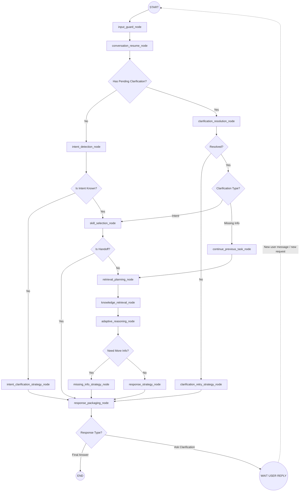

# LangGraph State & Flow Design (MVP)

## 1. Overview
This document maps the AI Reasoning MVP to a robust LangGraph implementation. It implements a complete **Clarification Resume Loop**, ensuring that if the bot asks a follow-up question, the next user message is correctly evaluated against that pending question before proceeding with normal reasoning.

## 2. Graph State Definition (`AgentState`)
The `AgentState` manages the conversation state, specifically keeping track of pending clarifications.

```typescript
interface AgentState {
  // 1. Input Context
  session_id: string;
  user_message: string;
  conversation_history: Message[];
  
  // 2. State & Resume Management
  is_safe: boolean;
  pending_clarification: {
    type: "intent" | "missing_info";
    original_intent?: string; // Stored if we were missing info
    missing_entities?: string[];
  } | null;
  clarification_resolved: boolean;

  // 3. Core Reasoning State
  intent: {
    name: string;
    confidence: number;
  } | null;
  selected_skill: string | null;

  // 4 & 5. Knowledge
  retrieval_plan: string[] | null;
  retrieved_knowledge: string | null;

  // 6 & 7. Reasoning & Strategy
  reasoning_level: "shallow" | "medium" | "deep" | null;
  need_more_info: boolean;
  response_strategy: string | null;

  // 8. Output
  response_type: "final_answer" | "ask_clarification";
  final_messages: {
    type: "text";
    content: string;
  }[] | null;
}
```

## 3. Implementation Checklist: Nodes & Edges
To build this graph, you will need to create exactly **14 Nodes** and define the corresponding routing **Edges**.

### A. The 14 Nodes (Actions)
| # | Node Name | Action / Responsibility | LLM Call Needed? |
| :--- | :--- | :--- | :---: |
| 1 | `input_guard_node` | Validates length, checks spam/injection. | Rule/Regex |
| 2 | `conversation_resume_node` | Checks `AgentState` for `pending_clarification`. | Rule |
| 3 | `clarification_resolution_node` | Evaluates if the user reply resolves the pending question. | Rule + gpt-5-nano |
| 4 | `clarification_retry_strategy_node` | Generates a simpler retry question. | Template / gpt-5-nano |
| 5 | `continue_previous_task_node` | Restores previous state/intent. | Rule |
| 6 | `intent_detection_node` | Classifies intent from a fresh message. | Rule + gpt-5-nano |
| 7 | `intent_clarification_strategy_node` | Creates a question to clarify vague intent. | Template / Rule |
| 8 | `skill_selection_node` | Maps intent to skill. | Rule |
| 9 | `retrieval_planning_node` | Creates RAG query based on collected slots. | Template / gpt-5-mini |
| 10 | `knowledge_retrieval_node` | Executes Vector/Keyword search. | DB Query |
| 11 | `adaptive_reasoning_node` | Central node: Checks RAG, checks missing info, drafts core answer OR drafts clarification question. | gpt-5-mini |
| 12 | `missing_info_strategy_node` | Standardizes the clarification question created by adaptive. | Template / Rule |
| 13 | `response_strategy_node` | Modifies style, tone, and message splitting based on core answer. | gpt-5-mini / gpt-5-nano |
| 14 | `response_packaging_node` | Technical packing for Zalo/FB (JSON payload). | Rule / Template |

### B. The Edges (Routing Logic)

**Normal Edges:**
* `START` ➔ `input_guard_node`
* `input_guard_node` ➔ `conversation_resume_node`
* `clarification_retry_strategy_node` ➔ `response_packaging_node`
* `continue_previous_task_node` ➔ `retrieval_planning_node`
* `intent_clarification_strategy_node` ➔ `response_packaging_node`
* `retrieval_planning_node` ➔ `knowledge_retrieval_node`
* `knowledge_retrieval_node` ➔ `adaptive_reasoning_node`
* `missing_info_strategy_node` ➔ `response_packaging_node`
* `response_strategy_node` ➔ `response_packaging_node`

**Conditional Edges (Decisions):**
1. **Has Pending Clarification?** (from `conversation_resume_node`)
   * If `No` ➔ `intent_detection_node`
   * If `Yes` ➔ `clarification_resolution_node`
2. **Resolved?** (from `clarification_resolution_node`)
   * If `No` ➔ `clarification_retry_strategy_node`
   * If `Yes` ➔ `Clarification Type` Check
3. **Clarification Type?** (if resolved)
   * If `Intent` ➔ `skill_selection_node`
   * If `Missing Info` ➔ `continue_previous_task_node`
4. **Is Intent Known?** (from `intent_detection_node`)
   * If `Yes` ➔ `skill_selection_node`
   * If `No` ➔ `intent_clarification_strategy_node`
5. **Is Handoff?** (from `skill_selection_node`)
   * If `Yes` ➔ `response_packaging_node`
   * If `No` ➔ `retrieval_planning_node`
6. **Need More Info?** (from `adaptive_reasoning_node`)
   * If `Yes` ➔ `missing_info_strategy_node`
   * If `No` ➔ `response_strategy_node`
7. **Response Type?** (from `response_packaging_node`)
   * If `Final Answer` ➔ `END`
   * If `Ask Clarification` ➔ `WAIT_USER_REPLY`

## 4. Graph Architecture (Mermaid)


