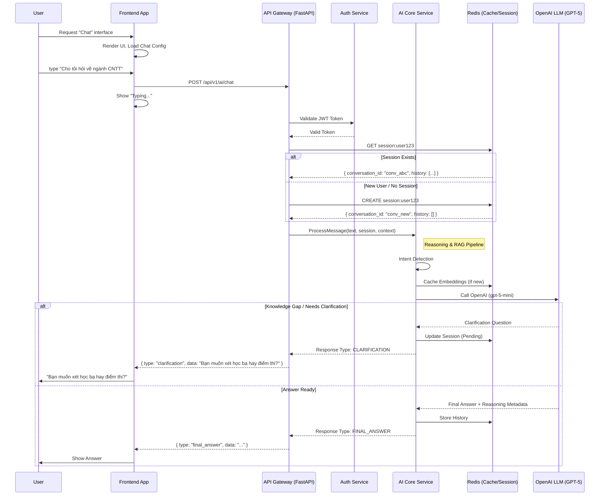

```mermaid
sequenceDiagram
    participant User
    participant Frontend as Frontend App
    participant Gateway as API Gateway (FastAPI)
    participant Auth as Auth Service
    participant AI as AI Core Service
    participant Redis as Redis (Cache/Session)
    participant LLM as OpenAI LLM (GPT-5)

    %% User opens chat
    User->>Frontend: Request "Chat" interface
    Frontend->>Frontend: Render UI, Load Chat Config

    %% User sends message
    User->>Frontend: type "Cho tôi hỏi về ngành CNTT"
    Frontend->>Gateway: POST /api/v1/ai/chat
    Frontend->>Frontend: Show "Typing..."

    %% Request begins
    Gateway->>Auth: Validate JWT Token
    Auth-->>Gateway: Valid Token

    %% Session Check (Crucial)
    Gateway->>Redis: GET session:user123
    alt Session Exists
        Redis-->>Gateway: { conversation_id: "conv_abc", history: [...] }
    else New User / No Session
        Gateway->>Redis: CREATE session:user123
        Redis-->>Gateway: { conversation_id: "conv_new", history: [] }
    end

    %% Processing
    Gateway->>AI: ProcessMessage(text, session, context)

    %% AI Core Logic
    Note right of AI: Reasoning & RAG Pipeline
    AI->>AI: Intent Detection
    AI->>Redis: Cache Embeddings (if new)
    AI->>LLM: Call OpenAI (gpt-5-mini)
    
    alt Knowledge Gap / Needs Clarification
        LLM-->>AI: Clarification Question
        AI->>Redis: Update Session (Pending)
        AI-->>Gateway: Response Type: CLARIFICATION
        Gateway-->>Frontend: { type: "clarification", data: "Bạn muốn xét học bạ hay điểm thi?" }
        Frontend->>User: "Bạn muốn xét học bạ hay điểm thi?"
    else Answer Ready
        LLM-->>AI: Final Answer + Reasoning Metadata
        AI->>Redis: Store History
        AI-->>Gateway: Response Type: FINAL_ANSWER
        Gateway-->>Frontend: { type: "final_answer", data: "..." }
        Frontend->>User: Show Answer
    end
```
